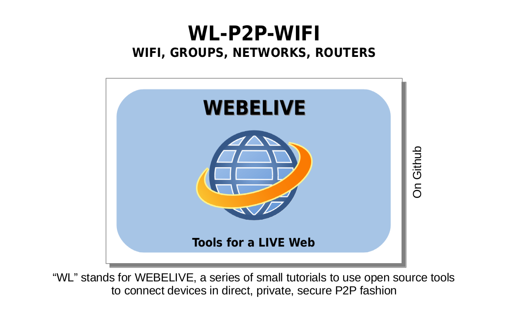
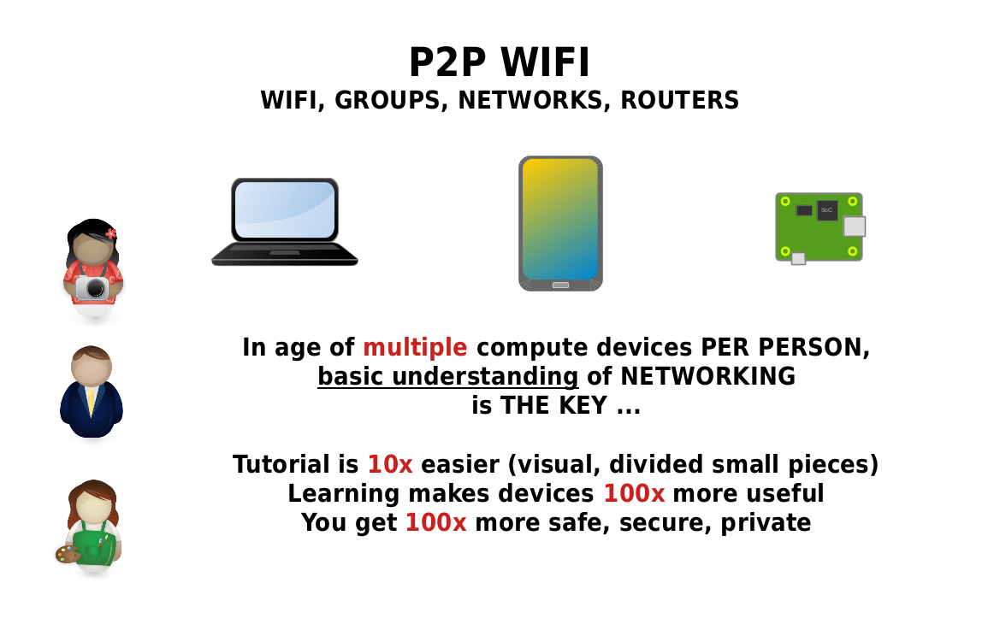
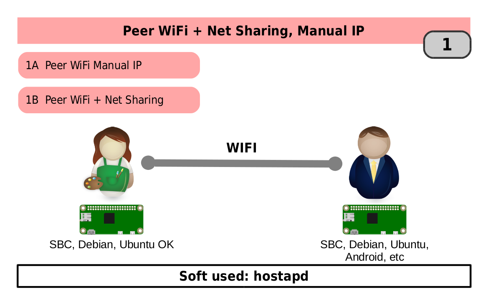
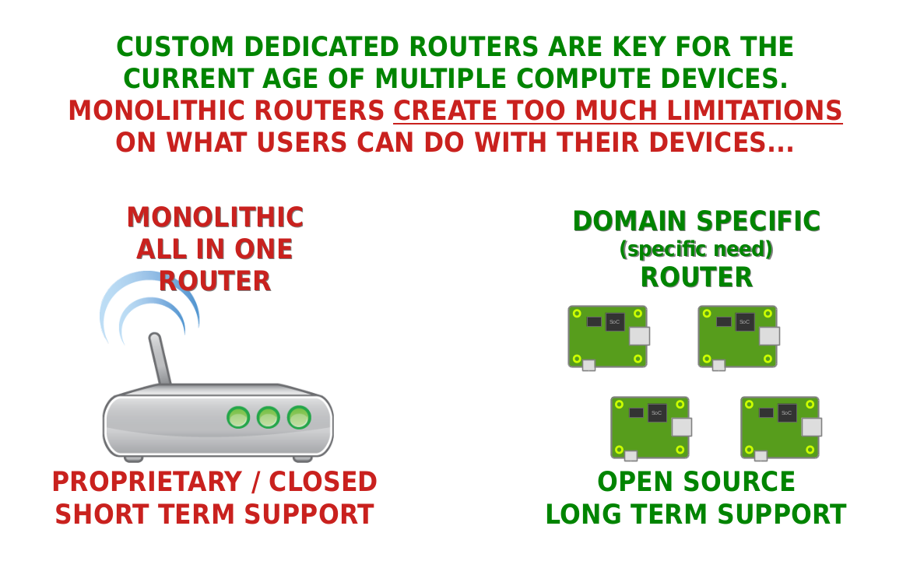
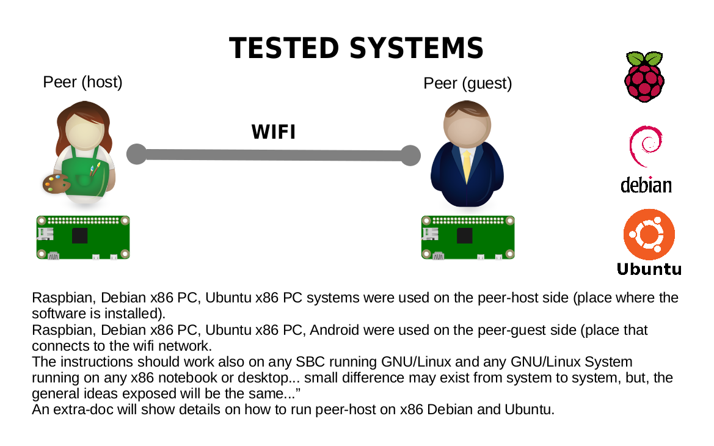

# Webelive P2P WIFI  
WiFi tools for P2P

  
---

  
---

  
---

  
---

  
---

  
---

  
---

  
---

  
---

  
---

  
---

  
---

  
---
  
  
**The first tutorial (1) is here (text, graphical and doc-pdf versions):**  
**TEXT**  
https://github.com/t2age/wl-p2p-wifi/tree/master/tutorial/tuto1  
  
**GRAPHICAL**  
https://github.com/t2age/wl-p2p-wifi/tree/master/tutorial/tuto1/slides  
  
**DOC-PDF**  
https://github.com/t2age/wl-p2p-wifi/tree/master/tutorial/tuto1/doc-pdf  
  
---
  
**The second tutorial (2) is here text, graphical and doc-pdf versions):**  
**TEXT**  
https://github.com/t2age/wl-p2p-wifi/tree/master/tutorial/tuto2  
  
**GRAPHICAL**  
https://github.com/t2age/wl-p2p-wifi/tree/master/tutorial/tuto2/slides  

**DOC-PDF**  
https://github.com/t2age/wl-p2p-wifi/tree/master/tutorial/tuto2/doc-pdf
  
---
  
**The thirdd tutorial (3) is here (text, graphical and doc-pdf versions):**  
**TEXT**  
https://github.com/t2age/wl-p2p-wifi/tree/master/tutorial/tuto3  
  
**GRAPHICAL**  
https://github.com/t2age/wl-p2p-wifi/tree/master/tutorial/tuto3/slides  

**DOC-PDF**  
https://github.com/t2age/wl-p2p-wifi/tree/master/tutorial/tuto3/doc-pdf
  
  
.
